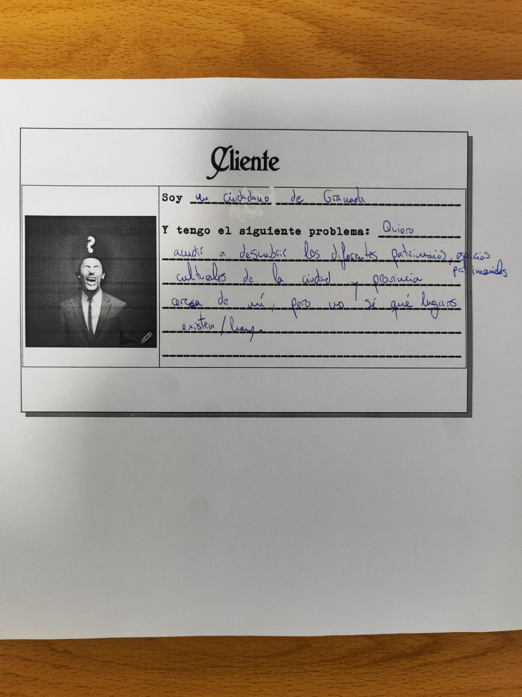

# CulturaGRX

## Problema

Este problema lo tienen muchos ciudadanos de la ciudad de Granada al igual que muchos turistas que vienen a visitar la ciudad y provincia, que cuando quieren en su tiempo libre, vacaciones o fines de semana o en el caso de los turistas en su visita no pueden ni saben descubrir ni visitar muchísimos espacios culturales y patrimoniales ya que la información de la que disponemos de su existencia es prácticamente nula, eso además de tampoco saber sus horarios de visita, la historia que tienen detrás esos espacios, etc. y es un problema porque muchos de estos edificios se encuentran vacíos, muchas personas no asisten porque no saben ni de su existencia y además el trabajo y esfuerzo de muchas personas se ve gravemente afectado e incluso en peligro. 

## Fuentes de datos

El problema necesita información sobre los diferentes bienes culturales y patrimoniales de Granada y provincia, que son joyas que están sin descubrir y por falta de información no conocemos ni están al alcance de nosotros. De diferentes fuentes abiertas podremos obtener información tanto de sus ubicaciones, sus estados, historia, formas de visitarlos, etc.

| Fuente | Datos que se usarán | Para qué parte del problema |
|--------|---------------------|-----------------------------|
| [Patrimonio Inmueble de Andalucía (IAPH)](https://www.juntadeandalucia.es/datosabiertos/portal/dataset/patrimonio-inmueble-de-andalucia) | API con formato en XML, CSV y JSON para aportar identificación, localización con coordenadas, tipología, periodo y protección de cada bien. | Para la parte de Qué espacios existen y dónde están |
| [Lista Roja del Patrimonio (Hispania Nostra)](https://listaroja.hispanianostra.org/) | Filtrar y Recopilar datos de la provincia de Granada, este no ofrece descarga de datos ni API nos proporciona datos sobre qué bienes están en riesgo de desaparición, su ubicación, situación, tipología ... | Cuáles están en riesgo |
| [Red de Consorcios de Transporte de Andalucía](https://api.ctan.es/) | JSON y GTFS descargable con paradas con coordenadas, líneas, horarios. | Cómo se llega en transporte público |
| [OpenStreetMap](https://www.openstreetmap.org/) | Base de datos colaborativa y abierta (licencia ODbL) que se consulta con la Overpass API, sirve para acceder a los diferentes horarios y disponibilidad | Horarios y accesibilidad |

En limitaciones encontramos en primer lugar con que en el IAPH no hay estado de conservación estructurado, tampoco contempla horarios y tiene dos fallos de calidad: Latitud y longitud están intercambiadas. En la iglesia de la Encarnación de Albolotela marca en "latitud_s": -3.657 y "longitud_s": 37.23, y en cambio Albolote está en latitud 37.23 y longitud -3.66. Como vemos estos valores están puestos al revés. Cuando vayamos a usar las coordenadas tenemos que tener esto en cuenta. El segundo fallo de calidad que he encontrado es que la bibliografía a veces no corresponde ya que en este ejemplo aparece un libro sobre un yacimiento de la Edad del Bronce en Purullena, que no tiene nada que ver con esta iglesia. 
También descubrí otra limitación dentro de esta página, esta es que muchos registros dentro de Granada y provincia no cuentan con su municipio ni localidad, por lo que va a haber que identificarlos por el es el principio del código de los bienes de Granada (0118). 

En la lista Roja del Patrimonio tendríamos la limitación de no ofrecer descarga de datos ni API. Habría que recopilar a mano los inmuebles culturales correspondientes a Granada y provincia, que no serán muchos, y compararlos con el catálogo del IAPH.

Otra limitación dentro de OpenStreetMap es que al ser colaborativa, está un poco incompleta, sobre todo los sitios poco conocidos.

## Juego de rol

## Documentación

- [Configuración del entorno](docs/configuracion.md)
