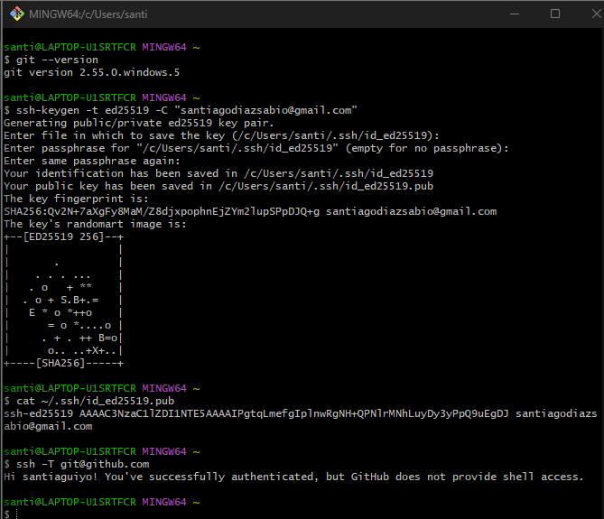
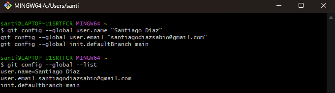

# Configuración del entorno

## Clave SSH y conexión con GitHub

En esta captura muestro la creación de mi llave pública y privada y la conexión con Github.

## Configuración de git

La captura siguiente muestra mi configuración en git, con mi nombre de usuario, mi email e inicianizándolo.

## Perfil de GitHub

Mi nuevo avatar en mi perfil de Github.

